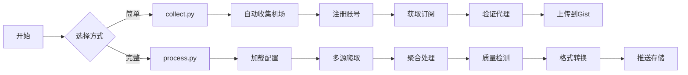

# New-ideas

## 🚀 两种使用方式

### 方式一：process.py（推荐）
**完整功能版本** - 支持复杂配置、多源爬取、自定义规则

```bash
# 1. 准备配置文件
cp subscribe/config/config.default.json my-config.json

# 2. 设置环境变量
export PUSH_TOKEN=your_github_token

# 3. 运行处理
python subscribe/process.py -s my-config.json
```

### 方式二：collect.py
**简化版本** - 快速收集机场订阅

```bash
# 直接运行，自动收集并上传到 Gist
python subscribe/collect.py \
    -g username/gist-id \
    -k your-github-token \
    -t clash v2ray singbox
```

## 📊 工作流程


